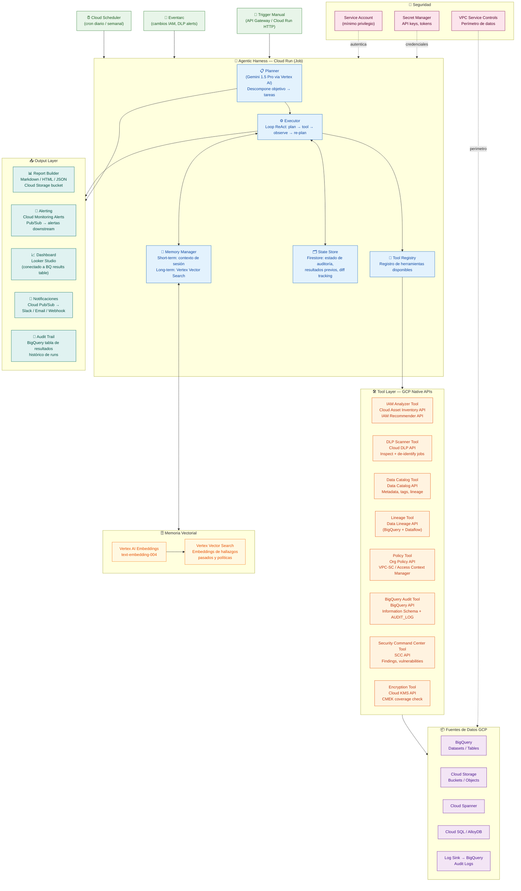

# Arquitectura: Bot Autónomo de Gobierno de Datos en GCP

## Diagrama de Arquitectura



## Leyenda de Capas

| Capa | Componentes | Tecnología |
|------|-------------|------------|
| **Orquestación** | Planner, Executor, Memory, State, Tool Registry | Cloud Run Jobs + Gemini 1.5 Pro |
| **Herramientas** | 8 tools especializadas | GCP Native APIs |
| **Memoria** | Short-term (sesión) + Long-term (vectorial) | Firestore + Vertex Vector Search |
| **Triggers** | Scheduled, Event-driven, Manual | Cloud Scheduler + Eventarc |
| **Output** | Reportes, alertas, dashboard, audit trail | GCS + BigQuery + Looker Studio |
| **Seguridad** | Service Account, Secret Manager, VPC-SC | GCP IAM + KMS |
```
